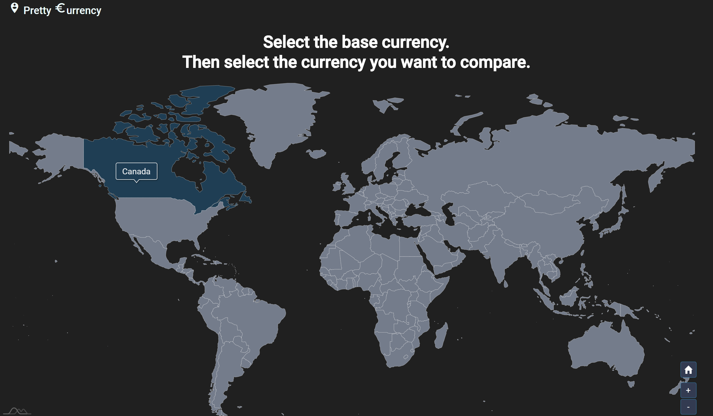
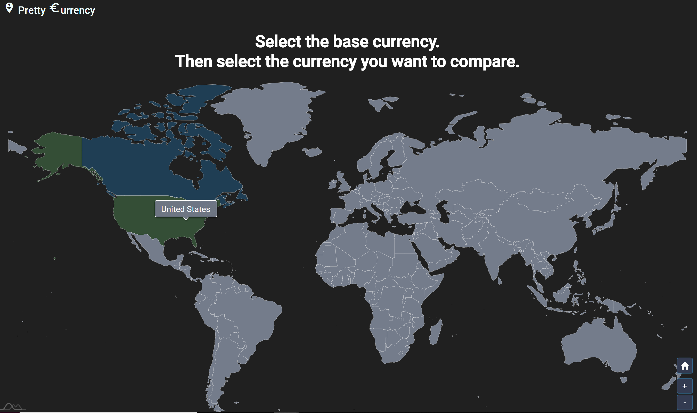
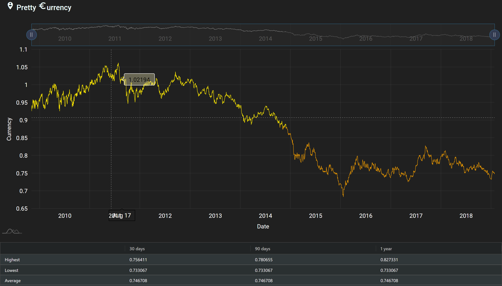

# Pretty Currency

Pretty Currency is a great data visualization tool for currency exchange rate supporting 34 currencies. 
This aplication is used with [Angular](https://angular.io/) with [amcharts](https://www.amcharts.com/), [d3](https://d3js.org/), [Angular Material](https://material.angular.io/)

### Getting started!

  - Simply come to our website https://pretty-currency.firebaseapp.com/
  - Choose the base currency.

  - Choose the exchange currency.

  - There you go, you will have a beautiful graphs with summary of statistics. Furthermore, you can customize currency rate by period easily.

### Further implementation
  - Not only used for exchange rates, but this tool can be used and extended with other topics such as stock market, cryptocurrency market, and anything that can be compared.
  - Implement various types of data visualization. 
  - Export with PDF, CSV, JSON etc.. / import dataset using with this application.
  - Train data to predict general anticipation of future graphs.

